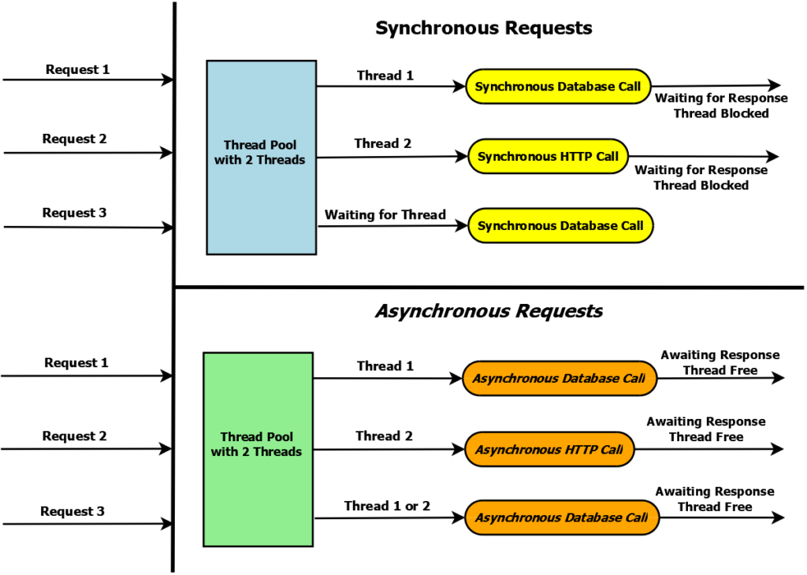

# Motivation

<a href="https://gitpod.io/#https://github.com/wahabshah/boost-asio-servers" rel="nofollow noopener noreferrer" target="_blank" class="after:hidden"></a>

* This repository contains the two types of echo servers :-
  * Sync using Per thread creation :- [echo-server-perthread.cpp](./echo-server-perthread.cpp)
  * Async using c++20 coroutines (stackless) creation :- [echo-server-coroutine.cpp](./echo-server-coroutine.cpp) 
* These two servers are defined in the paper [p2444r0.pdf](http://www.open-std.org/jtc1/sc22/wg21/docs/papers/2021/p2444r0.pdf) on page 16 :-

  
* The overall concept :-

  


```sh
wget -O asio.tar.gz https://sourceforge.net/projects/asio/files/asio/1.28.0%20%28Stable%29/asio-1.28.0.tar.gz/download
rm -rf asio && mkdir asio && tar -xvzf  asio.tar.gz --directory asio --strip-components=1
```


## Build Echo Server Per Thread Iteration1
```sh
rm -rf build && mkdir -p build && \
(cd build && cmake -DCMAKE_BUILD_TYPE=Debug .. && make clean all VERBOSE=1) && \
./build/echo-server-perthread
```

```sh
nc localhost 1083
```
```sh
hello
```


## Build Echo Server Coroutine Iteration1
```sh
rm -rf build && mkdir -p build && \
(cd build && cmake -DCMAKE_BUILD_TYPE=Debug .. && make clean all VERBOSE=1) && \
./build/echo-server-coroutine
```

```sh
nc localhost 1084
```
```sh
hello
```
# Links

* http://www.open-std.org/jtc1/sc22/wg21/docs/papers/2021/p2444r0.pdf
* https://procodeguide.com/programming/async-web-api-with-aspnet-core/
* https://gist.github.com/wahabshah/a775cb69e9e1242c43356370b6678eac
* https://www.youtube.com/watch?v=ZNttI_WswMU&t=2494s => How to Use C++20 Coroutines for Networking - Jim Pascoe - ACCU 2022
* https://www.youtube.com/watch?v=54oGgmMAUNk => Asynchronous I/O and Coroutines for Smooth Data Streaming - Bjorne Fahller - ACCU 2022
  * https://unixism.net/loti/ => Lord of the io_uring
  * https://github.com/facebookexperimental/libunifex =>  C++ sender/receiver async programming model 
  * https://www.youtube.com/watch?v=7sKUAyWXNHA => Pavel Novikov - "Understanding Coroutines by Example" - C++ London
